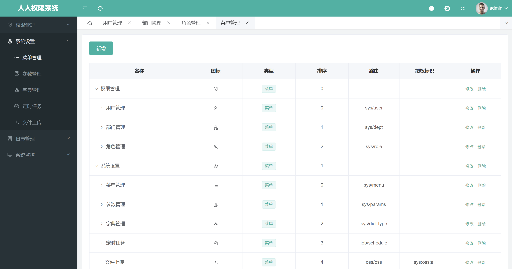

**项目说明**
- 一个轻量级的，前后端分离的Java快速开发平台，能快速开发项目并交付
- 采用SpringBoot、Shiro、MyBatis-Plus、Vue3、TypeScript、Element Plus、Vue Router、Pinia、Axios、Vite框架，开发的一套权限系统，极低门槛，拿来即用。设计之初，就非常注重安全性，为企业系统保驾护航，让一切都变得如此简单。
- 提供了代码生成器，只需编写30%左右代码，其余的代码交给系统自动生成，可快速完成开发任务
- 支持MySQL、达梦、Oracle、SQL Server、PostgreSQL等主流数据库
- 开发教程：https://www.renren.io/guide/security

<br>

**数据权限设计思想**
- 用户管理、角色管理、部门管理，可操作本部门及子部门数据
- 菜单管理、定时任务、参数管理、字典管理、系统日志，没有数据权限
- 业务功能，按照用户数据权限，查询、操作数据【没有本部门数据权限，也能查询本人数据】

<br> 

**项目结构**
```
renren-security
├─renren-common     公共模块
│ 
├─renren-admin      管理后台
│    ├─db  数据库SQL脚本
│    │ 
│    ├─modules  模块
│    │    ├─job 定时任务
│    │    ├─log 日志管理
│    │    ├─oss 文件存储
│    │    ├─security 安全模块
│    │    └─sys 系统管理(核心)
│    │ 
│    └─resources 
│        ├─mapper   MyBatis文件
│        ├─public  静态资源
│        └─application.yml   全局配置文件
│       
│ 
├─renren-api        API服务
│ 
├─renren-generator  代码生成器
│        └─resources 
│           ├─mapper   MyBatis文件
│           ├─template 代码生成器模板（可增加或修改相应模板）
│           ├─application.yml    全局配置文件
│           └─generator.properties   代码生成器，配置文件
│ 
├─renren-ui        Vue3前端工程
```

<br>

**技术选型：**
- 核心框架：Spring Boot 2.7
- 安全框架：Apache Shiro 1.12
- 持久层框架：MyBatis 3.5
- 定时器：Quartz 2.3
- 数据库连接池：Druid 1.2
- 日志管理：Logback
- 页面交互：Vue3.x

<br>

**软件需求**
- JDK1.8
- Maven3.0+
- MySQL8.0
- Oracle 11g+
- SQLServer 2012+
- PostgreSQL 9.4+
- 达梦8
<br>


**本地部署**
- 通过git下载源码
- idea、eclipse需安装lombok插件，不然会提示找不到entity的get set方法
- 创建数据库ic_agile，数据库编码为UTF-8
- 执行db/mysql.sql文件，初始化数据
- 修改application-dev.yml文件，更新MySQL账号和密码
- 在renren-security目录下，执行mvn clean install
- Eclipse、IDEA运行AdminApplication.java，则可启动项目
- renren-admin访问路径：http://localhost:8080/renren-admin
- swagger文档路径：http://localhost:8080/renren-admin/doc.html
- 再启动前端项目，前端地址：https://gitee.com/renrenio/renren-ui
- 账号密码：admin/admin
<br>



<br>

